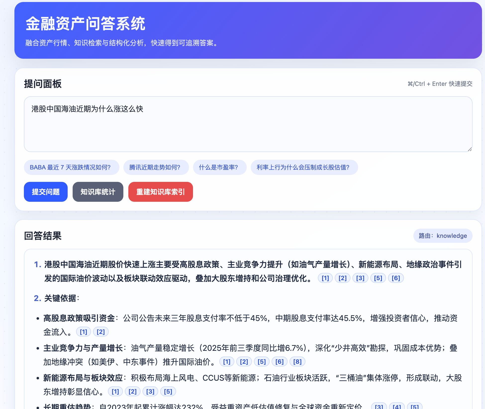
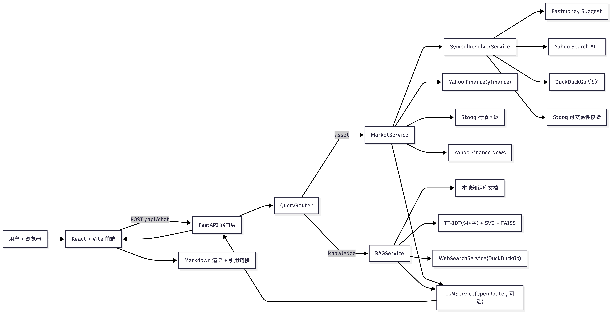

# Financial Asset QA System


基于 `FastAPI + React + 市场数据 + 检索增强生成（RAG）` 的金融问答系统。  
项目支持两类问题：

- **资产行情问答**：围绕美股/港股/A股代码，输出价格、涨跌、趋势与影响因素。
- **金融知识问答**：基于本地知识库 + Web 检索生成带引用的回答。

---

## 1. 系统架构图



---

## 2. 技术选型说明

### 后端

- **FastAPI**：提供 `chat`、知识库检索、重建索引、文档预览等 API，路由清晰、类型约束完整。
- **Pydantic v2**：统一请求/响应模型，前后端字段契约明确（如 `ChatResponse`、`SourceItem`）。
- **httpx**：统一外部 HTTP 调用（符号解析、搜索、LLM）。
- **Resilient HTTP Client**：对外部接口统一重试与指数退避（可通过环境变量调节）。
- **Query DSL Interpreter**：将“近期、大涨、事件日”等自然语言意图解析为结构化 DSL 槽位，驱动行情 API 调用参数。

### 行情与符号解析

- **AKShare + yfinance + pandas + numpy**：行情数据链路支持 AKShare 优先，结合 yfinance 与指标计算（7/14/30 日涨跌、波动率、趋势）。
- **A股 Eastmoney 回退**：A股在 AKShare / Yahoo 异常或限流时自动降级到 Eastmoney 历史 K 线接口。
- **Stooq 回退**：非 A 股场景下 Yahoo 异常/限流时自动降级，保证可用性。
- **多源符号解析策略**：
  - 显式代码正则识别；
  - Eastmoney Suggest（主）；
  - Yahoo Search（次）；
  - DuckDuckGo（兜底）；
  - Stooq `q/l` 可交易性校验。

### 知识检索（RAG）

- **文档支持**：`md/txt/json/csv/pdf`，递归扫描知识库目录。
- **混合向量化**：词级 TF-IDF + 字符级 TF-IDF，兼顾英文 ticker 与中文术语。
- **降维与检索**：`TruncatedSVD` + `FAISS(IndexFlatIP)`，用归一化向量实现余弦相似检索。
- **索引持久化**：保存 FAISS 与向量器对象；通过语料签名（文件大小、mtime、参数）判定是否复用。

### 前端

- **React 18 + Vite**：单页应用，开发时通过 Vite 代理 `/api` 到后端。
- **React Markdown + remark-gfm**：渲染结构化回答；引用格式 `[n]` 自动链接到来源。
- **自绘 SVG 趋势图**：展示收盘价/成交量切换、悬浮读数、区间涨跌。

---

## 3. Prompt 设计思路

### 3.1 资产问答 Prompt

资产链路会先产出结构化客观数据，再交给 LLM 组织语言。核心约束：

- **先结论后展开**：先回答用户指定周期（如近 7 天）或指定事件日（如 1 月 15 日）。
- **强结构输出**：固定四段：
  1) 直接结论  
  2) 客观数据  
  3) 可能影响因素（至少 4 条，覆盖财报/宏观/新闻/量价）  
  4) 风险提示
- **防幻觉约束**：不得预测未来、不得编造数据、引用必须使用 `[n]`。
- **事件日增强**：当用户提及具体日期且使用“大涨/大跌”表述时，先判断单日涨跌是否达到约 `3%` 阈值。

如果未配置 OpenRouter Key，系统会走**模板化兜底回答**，保证稳定可用。

### 3.2 知识问答 Prompt

- 输入内容为“编号后的检索片段”（本地 KB + Web）。
- 约束“**只能基于检索材料回答**”，每个关键结论至少一个引用。
- 输出结构：
  1) 直接回答  
  2) 关键依据（2~4 条）  
  3) 不确定性与边界
- 回答后会做引用规范化（剔除越界编号；若无引用则补默认引用）。

---

## 4. 数据来源说明

| 数据类型 | 来源 | 作用 | 备注 |
|---|---|---|---|
| 股票历史行情（主） | AKShare | 统一拉取 A 股 / 港股 / 美股日线 OHLCV | 默认优先数据源 |
| 股票历史行情 | Yahoo Finance (`yfinance`) | 计算涨跌、趋势、波动率、图表序列 | AKShare 不可用时回退 |
| A股行情回退 | Eastmoney Push2His API | A股在 Yahoo 失败时的降级数据 | A股专用回退 |
| 行情回退 | Stooq CSV 接口 | Yahoo 失败时的降级数据 | 保证可用性 |
| 公司相关新闻 | Yahoo Finance News | 影响因素线索（财报/宏观/公司） | 参与分析项生成 |
| 股票代码解析 | Eastmoney Suggest API | 中文公司名/模糊名称映射 symbol（含 A/H/US） | 主解析源 |
| 股票代码补充 | Yahoo Search API | 解析候选 symbol | 次解析源 |
| 解析兜底 | DuckDuckGo Search | 极端场景补充 symbol 候选 | 仅兜底 |
| 知识检索语料 | `app/data/knowledge_base/**` | 金融概念解释类问答 | 本地可维护 |
| 时效信息补充 | DuckDuckGo Search | 知识问题外部补充上下文 | 可通过 env 关闭 |

> 说明：资产价格类结论来自行情数据，不依赖知识库文本推断。

---

## 5. 关键能力概览

- **问题路由**：`QueryRouter` 将问题分为 `asset` 与 `knowledge`。
- **Query DSL 解释**：`QueryInterpreterService` 将自然语言映射为结构化意图（symbol / window_days / event_date / metrics）。
- **资产分析**：
  - 支持显式周期识别（如“近 30 天”）；
  - 支持事件日核验（交易日/非交易日、前后交易日提示）；
  - 回答中返回数据源、回退标记与分析置信度；
  - 自动生成价格与成交量序列供前端图表展示。
- **知识检索**：
  - 文档按标题分段 + 滑窗切片；
  - 关键字重叠 bonus 提升召回相关性；
  - 去重策略减少重复片段输出。
- **来源可追溯**：
  - 后端返回 `sources`；
  - 前端将 `[n]` 引用映射为可点击链接（KB 文档可在线预览）。

---

## 6. API 一览

- `GET /api/health`：健康检查
- `POST /api/chat`：统一问答入口（默认返回 `application/json`）
- `POST /api/chat?format=md`：返回 `text/markdown`（仅回答正文）
- `GET /api/kb/stats`：知识库索引状态
- `POST /api/kb/reindex`：重建知识库索引
- `POST /api/kb/search`：知识库检索调试
- `GET /api/kb/document?path=...`：下载/查看原文
- `GET /api/kb/document/preview?path=...`：在线预览文档

`/api/chat` 也支持通过 `Accept: text/markdown` 协商 Markdown 返回。例如：

```bash
curl -sS -X POST \
  -H "Content-Type: application/json" \
  -H "Accept: text/markdown" \
  -d '{"query":"通货膨胀的定义"}' \
  http://127.0.0.1:8000/api/chat
```

---

## 7. 本地运行

### 7.1 安装依赖

```bash
python -m venv .venv
source .venv/bin/activate
pip install -r requirements.txt
```

```bash
cd frontend
npm install
cd ..
```

### 7.2 配置环境变量

```bash
cp .env.example .env.local
```

重点配置：

- `OPENROUTER_API_KEY`：可选；为空时启用后端模板回答。
- `LOG_LEVEL`：后端日志级别（如 `DEBUG/INFO/WARNING/ERROR`）。
- `QUERY_INTERPRETER_USE_LLM`：是否启用 OpenRouter 大模型解析查询 DSL；系统默认“API/规则优先，LLM 仅在歧义场景介入”。
- `WEB_SEARCH_ENABLED`：是否开启 Web 检索补充。
- `KB_*`：知识库路径、分块参数、索引目录。
- `EXTERNAL_API_*`：外部 API 最大重试次数与退避间隔。
- `AKSHARE_*`：是否启用 AKShare 及复权模式。
- `SYMBOL_RESOLVER_*`：符号解析链路开关（Yahoo 搜索 / Web 兜底 / 交易校验），默认仅 Eastmoney API。
- `EVENT_LARGE_MOVE_THRESHOLD_PCT`：大涨/大跌阈值配置。

### 7.3 启动

先构建前端（让后端可直接托管静态资源）：

```bash
cd frontend
npm run build
cd ..
```

启动服务：

```bash
uvicorn app.main:app --reload --host 0.0.0.0 --port 8000
```

访问：

- `http://localhost:8000`
- `http://localhost:8000/api/health`

可选：手动重建知识库

```bash
python scripts/reindex_kb.py
```

---

## 8. 项目结构

```text
.
├── app
│   ├── api/routes.py
│   ├── common/
│   │   ├── http_client.py
│   │   ├── logger.py
│   │   ├── market_rules.py
│   │   └── symbol_utils.py
│   ├── core/config.py
│   ├── models/
│   │   ├── query_dsl.py
│   │   └── schemas.py
│   ├── services/
│   │   └── layers/
│   │       ├── orchestration/answer_service.py
│   │       ├── routing/
│   │       │   ├── query_interpreter_service.py
│   │       │   └── router_service.py
│   │       ├── asset/
│   │       │   ├── market_service.py
│   │       │   └── symbol_resolver_service.py
│   │       ├── knowledge/
│   │       │   ├── rag_service.py
│   │       │   └── web_search_service.py
│   │       └── integration/llm_service.py
│   └── data/knowledge_base/**
├── frontend/src
│   ├── App.jsx
│   ├── components/*
│   ├── constants/chat.js
│   └── utils/*
├── scripts/reindex_kb.py
└── requirements.txt
```

---

## 9. 优化与扩展思考

1. **Agent Skills能力建设**  
   支持多轮对话，项目抽象和总结成为Agent Skills用于对接各平台，并搭建Agen长记忆模块和用户行为偏好。

2. **RAG 检索增强**  
   在现有召回后增加 reranker；长文档可引入层级索引（文档级 → 段落级）提升精度与性能。以及后续Milvus集群扩展。

3. **投研系统的支持**  
   做好对过去的分析系统，将这个系统代入真正的生产力，做到每日对股票的盘前扫描、盘中监测、盘后分析。

4. **评测体系建设**  
   建立离线评测集（资产问答 + 知识问答），持续跟踪引用正确率、事实一致性与响应时延。
