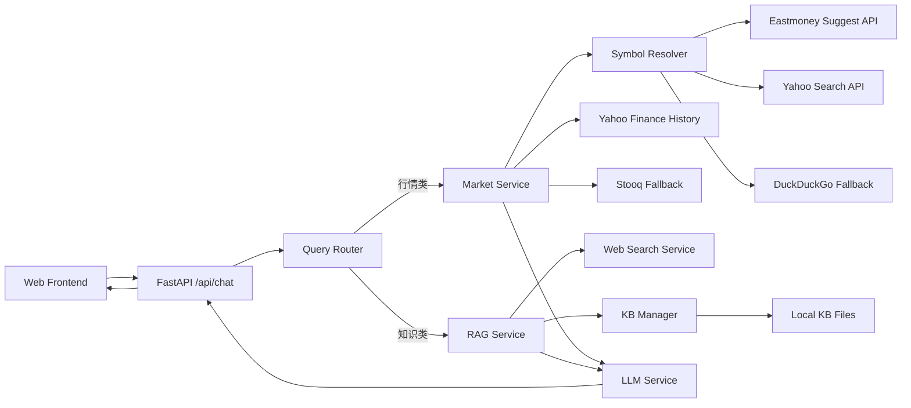

# Financial Asset QA System

基于大模型 + 行情数据 + 通用 RAG 的全栈金融资产问答系统（MVP）。

## 1. 项目能力

- 资产行情问答（核心）
  - 动态股票解析（中文公司名可直接问，如“小米最近 7 天涨跌”）
  - 7 日 / 30 日涨跌幅计算
  - 14 日趋势分类（上涨 / 下跌 / 震荡）
  - 结合新闻做“可能影响因素”分析
- 金融知识问答（RAG）
  - 通用知识库（支持 `.md/.txt/.json/.csv/.pdf`）
  - 目录递归扫描 + 自动分块
  - 混合检索（词级 TF-IDF + 字符级 TF-IDF）
  - Web Search（DuckDuckGo）补充上下文
- 结构化回答生成
  - 明确区分“客观数据”与“分析描述”
  - 优先使用检索/行情结果，降低幻觉

## 2. 技术栈

- 前端：静态 HTML + JS（`app/static/index.html`）
- 后端：FastAPI（`app/main.py`）
- LLM：OpenRouter API（可选）
- 行情：`yfinance`（Yahoo Finance）+ Stooq Fallback
- 证券解析：东方财富 Suggest API + Yahoo Search + Web 兜底
- 向量检索：`scikit-learn` TF-IDF + cosine similarity

## 3. 系统架构图



## 4. 核心链路说明

### 4.1 资产问题路由

- 行情类问题（股价/涨跌/走势/代码/公司名）→ `MarketService`
- 知识类问题（定义/区别/财报解释等）→ `RAGService + WebSearchService`

> 资产问答不依赖知识库生成价格，强制走行情 API。

### 4.2 股票解析（已去除静态映射）

`SymbolResolverService` 解析顺序：

1. 识别显式代码（如 `BABA`、`1810.HK`）
2. 东方财富 `suggest` API（主解析源）
3. Yahoo Search API（备选）
4. Web 检索兜底（DuckDuckGo）
5. 对候选代码做可交易性校验（Stooq `q/l` 接口）

### 4.3 行情获取降级策略

1. 优先 Yahoo Finance（`yfinance`）
2. 若限流/异常（如 `YFRateLimitError`），自动降级 Stooq
3. 返回中标注数据来源（Yahoo 或 Stooq Fallback）

## 5. Prompt 设计思路

- 资产问答 Prompt
  - 输入：结构化行情数据 + 分析线索（新闻、波动事件）
  - 约束：先客观数据、再分析、禁止预测、禁止编造
- RAG 问答 Prompt
  - 输入：知识库召回片段 + Web 召回片段
  - 约束：基于检索回答；信息不足时显式说明不确定性

## 6. 数据来源说明

- 证券解析：
  - 东方财富 Suggest API：`https://searchapi.eastmoney.com/api/suggest/get`
  - Yahoo Search API：`https://query1.finance.yahoo.com/v1/finance/search`
  - DuckDuckGo Search（兜底）
- 行情数据：
  - Yahoo Finance（`yfinance`）
  - Stooq（限流降级）
- 新闻线索：Yahoo Finance News（`Ticker.news`）
- 知识库：本地通用文档目录（`app/data/knowledge_base/**`）

## 7. 通用知识库能力

- 支持格式：`md`、`txt`、`json`、`csv`、`pdf`
- 递归索引：支持按行业/主题分目录管理语料
- 动态维护：支持 API 或脚本重建索引

知识库管理接口：

- `GET /api/kb/stats`：查看索引状态
- `POST /api/kb/reindex`：重建索引（请求体：`{"force": true}`）

## 8. API 一览

- `GET /api/health`
- `POST /api/chat`
- `GET /api/kb/stats`
- `POST /api/kb/reindex`

## 9. 目录结构

```text
.
├── app
│   ├── api/routes.py
│   ├── core/config.py
│   ├── data/knowledge_base/**
│   ├── models/schemas.py
│   ├── services/
│   │   ├── answer_service.py
│   │   ├── llm_service.py
│   │   ├── market_service.py
│   │   ├── rag_service.py
│   │   ├── router_service.py
│   │   ├── symbol_resolver_service.py
│   │   └── web_search_service.py
│   ├── static/index.html
│   └── main.py
├── scripts/reindex_kb.py
├── requirements.txt
└── .env.example
```

## 10. 运行方式

1) 安装依赖

```bash
python -m venv .venv
source .venv/bin/activate
pip install -r requirements.txt
```

2) 配置环境变量

```bash
cp .env.example .env.local
# 按需填写 OPENROUTER_API_KEY
```

配置加载优先级：

- 先加载 `.env`
- 再加载 `.env.local`（覆盖前者）

3) 启动服务

```bash
uvicorn app.main:app --reload --host 0.0.0.0 --port 8000
```

4) 访问页面

- `http://localhost:8000`
- 健康检查：`http://localhost:8000/api/health`

5) 重建知识库索引（可选）

```bash
python scripts/reindex_kb.py
```

## 11. 示例问题

- 小米最近 7 天的涨跌情况如何？
- 腾讯近期走势如何？
- 阿里巴巴当前股价是多少？
- BABA 最近 30 天涨跌情况如何？
- 什么是市盈率？
- 收入和净利润的区别是什么？
- 利率上行为什么会压制成长股估值？

## 12. 已知说明

- `GET /favicon.ico` 或 `/.well-known/...` 的 404 多为浏览器探测请求，可忽略。
- 上游行情 API 可能偶发限流，系统会自动降级到 Stooq；数据来源会在回答中标注。

## 13. 可扩展优化方向

- 增加多市场符号歧义消解（如同名公司优先美股/港股策略）
- 引入缓存层（symbol 解析、行情缓存）降低外部 API 调用频率
- 向量库替换为 Milvus / pgvector 以支持更大知识库
- 增加事件归因链路（财报/宏观日历/公告）
- 引入多 Agent（路由/检索/验证/回答）进一步降低幻觉
